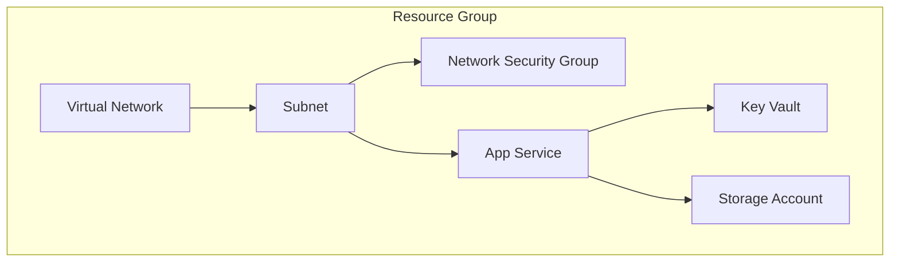

# Workload Documentation Standards

Guidelines for generating comprehensive Azure workload documentation that synthesizes
IaC artifacts into customer-deliverable design documents, operational runbooks, and
compliance artifacts.

## Document Purpose

Workload documentation serves as:

- **Customer deliverables** for consulting engagements and project handovers
- **Operational reference** for day-2 operations teams
- **Compliance evidence** for audits and regulatory requirements
- **Knowledge preservation** for long-term maintainability

---

## Source Artifact Integration

### Required Sources

Documentation must be synthesized from existing agentic workflow outputs:

| Source                 | Location                           | Content to Extract                               |
| ---------------------- | ---------------------------------- | ------------------------------------------------ |
| WAF Assessment         | `02-architecture-assessment.md`    | Business context, pillar scores, recommendations |
| Cost Estimate          | `03-des-cost-estimate.md`          | Monthly/annual costs, SKU rationale              |
| Implementation Plan    | `04-implementation-plan.md`        | Resource specs, dependencies, phases             |
| Governance Constraints | `04-governance-constraints.md`     | Azure Policy requirements                        |
| Bicep Code             | `infra/bicep/{project}/`           | Resource definitions, parameters, outputs        |

### Optional Sources

| Source           | Location                | Content to Extract                          |
| ---------------- | ----------------------- | ------------------------------------------- |
| Design Diagram   | `03-des-diagram.png`    | Pre-implementation architecture             |
| As-Built Diagram | `07-ab-diagram.png`     | Deployed architecture                       |
| ADRs             | `*-adr-*.md`            | Decision rationale, alternatives considered |

### Integration Rules

1. **Reference, don't duplicate** - Link to existing documents rather than copying content
2. **Extract and summarize** - Pull key data points, summarize for appropriate audience
3. **Maintain traceability** - Always cite source artifacts
4. **IaC is source of truth** - Resource details come from Bicep, not assumptions

---

## File Naming Conventions

All workload documentation files use `07-` prefix:

| File                        | Purpose                                  | Required |
| --------------------------- | ---------------------------------------- | -------- |
| `07-documentation-index.md` | Master index of all documentation        | Yes      |
| `07-design-document.md`     | Comprehensive 10-section design document | Yes      |
| `07-operations-runbook.md`  | Day-2 operational procedures             | Yes      |
| `07-resource-inventory.md`  | Complete resource listing from IaC       | Yes      |
| `07-compliance-matrix.md`   | Security controls and compliance mapping | Optional |
| `07-backup-dr-plan.md`      | Backup and disaster recovery procedures  | Optional |

---

## Design Document Structure (10 Sections)

The main design document follows this structure based on Azure best practices:

### Section 1: Introduction

**Purpose**: Set context and scope

**Required Content**:

- Document purpose and intended audience
- Project overview (from WAF assessment)
- Design objectives and success criteria
- Constraints and assumptions
- Stakeholder table with roles and responsibilities

**Best Practices**:

- Keep introduction concise (1-2 pages max)
- Link to detailed requirements if they exist elsewhere
- State what is IN scope and OUT of scope explicitly

### Section 2: Azure Architecture Overview

**Purpose**: Provide high-level architecture context

**Required Content**:

- Architecture diagram (reference `07-ab-diagram.png`)
- Subscription and resource group organization
- Region selection with rationale
- Naming conventions (extract from Bicep)
- Tagging strategy table

**Best Practices**:

- Include the diagram inline with surrounding context
- Explain WHY regions were chosen (not just which ones)
- Show resource group structure as a table or tree

### Section 3: Networking

**Purpose**: Document network architecture

**Required Content**:

- Network topology description
- Virtual Networks table (name, address space, region, purpose)
- Subnets table (name, CIDR, NSG, purpose)
- NSG summary (detail in appendix)
- DNS configuration
- Connectivity (ExpressRoute, VPN, peering)

**Best Practices**:

- Use CIDR notation consistently
- Keep detailed IP allocations in appendix
- Document network security at summary level here

### Section 4: Storage

**Purpose**: Document storage architecture

**Required Content**:

- Storage accounts table (name, SKU, replication, purpose)
- Encryption configuration
- Access controls (RBAC, SAS, private endpoints)
- Lifecycle management if configured

**Best Practices**:

- Document redundancy choices with rationale
- Note any blob/file/queue/table usage patterns

### Section 5: Compute

**Purpose**: Document compute resources

**Required Content**:

- Compute resources table (name, type, SKU, purpose)
- Scaling configuration (auto-scale rules)
- Availability configuration (zones, sets)

**Best Practices**:

- Group by compute type (App Service, Functions, VMs)
- Include SKU selection rationale (reference cost estimate)

### Section 6: Identity & Access

**Purpose**: Document IAM architecture

**Required Content**:

- Authentication method
- RBAC assignments table (principal, role, scope)
- Managed identities list
- Service principals if applicable

**Best Practices**:

- Follow least-privilege principle documentation
- Document conditional access if configured

### Section 7: Security & Compliance

**Purpose**: Document security posture

**Required Content**:

- Security baseline alignment
- Network security summary
- Data protection (encryption, key management)
- Compliance requirements
- Azure Policy summary (reference governance constraints)

**Best Practices**:

- Reference Azure Security Benchmark
- Link to detailed compliance matrix if generated

### Section 8: Backup & Disaster Recovery

**Purpose**: Document resilience strategy

**Required Content**:

- Backup strategy table (resource, method, retention, RPO)
- DR metrics table (RTO, RPO targets)
- High-level failover procedures

**Best Practices**:

- Link to detailed DR plan if generated
- Include both backup AND restore procedures

### Section 9: Management & Monitoring

**Purpose**: Document operations strategy

**Required Content**:

- Monitoring strategy (Log Analytics, App Insights)
- Alerting table (alert, condition, severity, action)
- Diagnostics configuration
- Maintenance/patching strategy

**Best Practices**:

- Include sample KQL queries for common scenarios
- Document alert escalation paths

### Section 10: Appendix

**Purpose**: Detailed reference information

**Required Content**:

- Link to resource inventory
- Full IP address allocation table
- Detailed NSG rules
- Link to cost estimate
- Links to relevant ADRs
- External references (WAF, CAF, Architecture Center)

**Best Practices**:

- Keep appendix for detailed data, not narrative
- Use tables extensively for easy scanning

---

## Operations Runbook Standards

### Structure

1. **Quick Reference** - Key information at a glance
2. **Daily Operations** - Health checks, log review
3. **Routine Maintenance** - Weekly/monthly tasks, patching
4. **Incident Response** - Severity definitions, common issues
5. **Scaling Procedures** - Scale up/down procedures
6. **Deployment Procedures** - Standard, emergency, rollback
7. **Contact Information** - On-call, escalation paths

### Best Practices

- Include actual commands and scripts where helpful
- Use severity levels consistently (Sev 1-4)
- Provide step-by-step procedures, not just descriptions
- Include rollback procedures for every deployment step

---

## Resource Inventory Standards

### Structure

1. **Summary** - Resource counts by category
2. **Resource Listing** - Tables by resource type
3. **IP Address Allocation** - Complete IP mapping
4. **Dependencies** - Mermaid diagram showing relationships
5. **Tags Applied** - Tag values per resource

### Extraction from Bicep

Parse Bicep files to extract:

```bicep
// Extract resource type, name, SKU, location
resource appService 'Microsoft.Web/sites@2023-12-01' = {
  name: appServiceName        // → Name column
  location: location          // → Location column
  sku: { name: 'P1v3' }       // → SKU column
  // ...
}
```

### Dependency Mapping

Generate Mermaid diagrams from Bicep dependencies:



---

## Visual Standards

### Status Indicators

| Status      | Indicator | Usage                     |
| ----------- | --------- | ------------------------- |
| Complete    | ✅        | Section/document complete |
| In Progress | 🔄        | Work in progress          |
| Not Started | ⏳        | Pending                   |
| Warning     | ⚠️        | Attention needed          |
| Critical    | ❌        | Issue or blocker          |

### Tables

- Use consistent column ordering
- Include headers on all tables
- Align columns appropriately (left for text, right for numbers)
- Keep tables readable (max 6-7 columns)

### Code Blocks

- Use fenced code blocks with language hints
- Include context comments in code examples
- Use `bicep`, `powershell`, `bash`, `kusto` as appropriate

---

## Quality Checklist

Before finalizing documentation:

### Content Completeness

- [ ] All 10 design document sections populated
- [ ] Resource inventory matches Bicep definitions
- [ ] Operations runbook has actionable procedures
- [ ] Dependencies clearly mapped

### Source Integration

- [ ] WAF assessment referenced for business context
- [ ] Cost estimate linked in appendix
- [ ] Diagrams embedded or referenced
- [ ] ADRs linked for decision rationale
- [ ] Governance constraints incorporated

### Formatting

- [ ] Consistent heading levels
- [ ] Tables formatted correctly
- [ ] Status indicators used appropriately
- [ ] Code blocks have language hints
- [ ] Links work correctly

### Accuracy

- [ ] Resource names match Bicep definitions
- [ ] SKUs and configurations accurate
- [ ] Regional information correct
- [ ] Tag values match implementation

---

## Anti-Patterns to Avoid

| Anti-Pattern                | Problem                           | Solution                  |
| --------------------------- | --------------------------------- | ------------------------- |
| Duplicating Microsoft docs  | Stale content, maintenance burden | Link to official docs     |
| Copying full WAF assessment | Redundant, out of sync            | Reference and summarize   |
| Manual resource inventory   | Prone to errors, stale            | Extract from IaC          |
| Generic procedures          | Not actionable                    | Include specific commands |
| Missing rationale           | "What" without "why"              | Document decision context |
| Overly long sections        | Hard to navigate                  | Use appendix for details  |
