# Agentic InfraOps

> **Version 3.1.0** | Last Updated: December 3, 2025 | [Changelog](VERSION.md)

🔗 **Shortlink**: [aka.ms/agenticinfraops](https://aka.ms/agenticinfraops)

---

> **Azure infrastructure engineered by agents. Verified. Well-Architected. Deployable.**
>
> Agentic InfraOps revolutionizes how IT Pros build Azure environments. Powered by GitHub Copilot
> and coordinated AI agents, it transforms requirements into architecture diagrams, validated designs,
> and deploy-ready Bicep/Terraform templates—all aligned with Azure Well-Architected best practices
> and Azure Verified Modules. Real-time pricing, compliance checks, and automation included.

📖 **[Quick Start Guide](docs/getting-started/QUICKSTART.md)** | 📋 **[Full Workflow Docs](docs/workflow/WORKFLOW.md)** | 🎯 **[Scenarios](scenarios/)** | 💰 **[Azure Pricing MCP](mcp/azure-pricing-mcp/)**

<h2>🬠The Workflow</h2>

  

```mermaid
%%{init: {'theme':'base', 'themeVariables': {'primaryColor': '#0078D4', 'primaryTextColor': '#ffffff', 'primaryBorderColor': '#005A9E', 'lineColor': '#6B7280', 'secondaryColor': '#00B4AB', 'tertiaryColor': '#8957E5', 'background': '#ffffff', 'mainBkg': '#ffffff', 'nodeBorder': '#005A9E', 'clusterBkg': '#F3F4F6', 'titleColor': '#1F2937', 'edgeLabelBackground': '#ffffff'}}}%%
graph LR
    P["🎯 @plan"]:::plan --> A["🏛️ azure-principal-architect"]:::architect
    A --> B["📋 bicep-plan"]:::bicep
    B --> I["⚙️ bicep-implement"]:::bicep
    MCP["💰 Azure Pricing MCP"]:::pricing -.->|costs| A
    MCP -.->|validation| B
    D["📊 diagram-generator"]:::diagram -.->|visuals| A

    classDef plan fill:#8957E5,stroke:#6B46C1,color:#fff
    classDef architect fill:#0078D4,stroke:#005A9E,color:#fff
    classDef bicep fill:#00B4AB,stroke:#008F89,color:#fff
    classDef pricing fill:#FF6B35,stroke:#E55A25,color:#fff
    classDef diagram fill:#6B7280,stroke:#4B5563,color:#fff
```

**Agent Legend**

| Color | Agent | Role |
| ----- | ----- | ---- |
| 🟣 | `@plan` | Gather and refine requirements |
| 🔵 | `azure-principal-architect` | WAF assessment (NO code) |
| 🟢 | `bicep-plan` / `bicep-implement` | Implementation plan & Bicep generation |
| 🟠 | `Azure Pricing MCP` | Real-time cost estimation |
| ⚫ | `diagram-generator` | Architecture visualization |

| Step | Agent                       | What It Does                         | Optional                |
| ---- | --------------------------- | ------------------------------------ | ----------------------- |
| 1    | `@plan`                     | Gather requirements                  | -                       |
| 2    | `azure-principal-architect` | WAF assessment (NO code)             | 💰 Pricing, 📊 Diagrams |
| 3    | `bicep-plan`                | Implementation plan with AVM modules | 💰 Pricing              |
| 4    | `bicep-implement`           | Generate & validate Bicep            | -                       |

> **Optional:** `adr-generator` for Architecture Decision Records after any step

---

## Quick Start

**Get up and running in 5 steps:**

| Step | Action | Details |
| ---- | ------ | ------- |
| 1️⃣ | **Install Prerequisites** | [Docker Desktop](https://www.docker.com/products/docker-desktop/) + [VS Code](https://code.visualstudio.com/) with [GitHub Copilot](https://marketplace.visualstudio.com/items?itemName=GitHub.copilot) |
| 2️⃣ | **Clone & Open** | `git clone https://github.com/jonathan-vella/azure-agentic-infraops.git` then `code azure-agentic-infraops` |
| 3️⃣ | **Open in Dev Container** | Press `F1` → "Dev Containers: Reopen in Container" (wait ~2 min) |
| 4️⃣ | **Open Copilot Chat** | Press `Ctrl+Alt+I` → Click **Agent** button (`Ctrl+Shift+A`) → Select `@plan` |
| 5️⃣ | **Try It** | Type: `@plan Create a web app with Azure App Service and SQL Database` |

Each agent asks for approval before proceeding. Say `yes` to continue, or provide feedback to refine.

📖 **[Full Quick Start Guide →](docs/getting-started/QUICKSTART.md)** (includes troubleshooting, demo scenarios, deployment instructions)

---

## Project Structure

| Directory                | Purpose                               |
| ------------------------ | ------------------------------------- |
| `.github/agents/`        | Agent definitions (5 custom agents)   |
| `mcp/azure-pricing-mcp/` | 💰 Real-time Azure pricing MCP server |
| `infra/bicep/`           | Generated Bicep templates             |
| `docs/`                  | Documentation, guides, diagrams       |
| `scenarios/`             | 10 hands-on learning scenarios        |

---

<h2>🯠Scenarios</h2>

**10 hands-on scenarios** from beginner to advanced (15-45 min each):

| Level | Topics |
| ----- | ------ |
| **Beginner** | Bicep/Terraform baselines, documentation generation, diagrams as code |
| **Intermediate** | Service validation, troubleshooting, SBOM generation |
| **Advanced** | Full 5-agent workflow, async coding agent |

📖 **[Full Scenarios Guide →](scenarios/README.md)**

---

<h2>📋 Requirements</h2>

| Requirement | Details |
| ----------- | ------- |
| **VS Code** | With [GitHub Copilot](https://marketplace.visualstudio.com/items?itemName=GitHub.copilot) extension |
| **Dev Container** | [Docker Desktop](https://www.docker.com/products/docker-desktop/) or [GitHub Codespaces](https://github.com/features/codespaces) |
| **Azure subscription** | For deployments (optional for learning) |

**Included in Dev Container:**

- ✅ Azure CLI with Bicep extension
- ✅ PowerShell 7+ and Python 3.10+
- ✅ All required VS Code extensions
- ✅ Azure Pricing MCP server (auto-configured)

---

[Contributing](CONTRIBUTING.md) | [License (MIT)](LICENSE)
