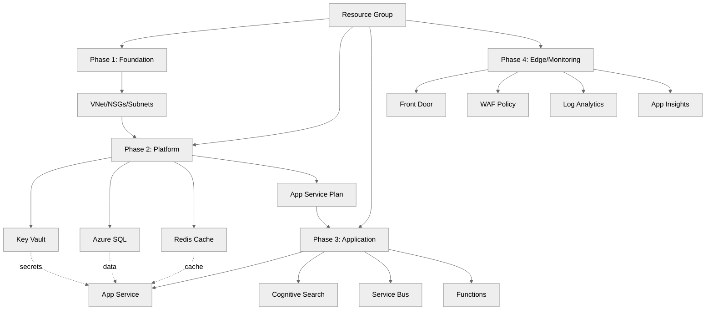

# Step 4: Implementation Plan - E-Commerce Platform

> Generated by bicep-plan agent | 2026-01-13

## Overview

E-commerce platform implementation using phased Bicep approach to manage complexity across
4 deployment phases: Foundation (VNet/NSGs), Platform Services (Key Vault/SQL/Redis),
Application Tier (App Service/Search/Service Bus), and Edge & Monitoring (Front Door/WAF).
Total of 26 resources across phases with estimated monthly cost of ~$1,826.

---

## Resource Inventory

| Resource                    | Type                                                      | SKU       | Dependencies |
| --------------------------- | --------------------------------------------------------- | --------- | ------------ |
| Virtual Network             | Microsoft.Network/virtualNetworks                         | Standard  | None         |
| Network Security Groups (3) | Microsoft.Network/networkSecurityGroups                   | Standard  | VNet         |
| Key Vault                   | Microsoft.KeyVault/vaults                                 | Premium   | NSG          |
| App Service Plan            | Microsoft.Web/serverfarms                                 | P1v3      | NSG          |
| Azure SQL Server            | Microsoft.Sql/servers                                     | Standard  | NSG          |
| Azure SQL Database          | Microsoft.Sql/servers/databases                           | S1        | SQL Server   |
| Azure Cache for Redis       | Microsoft.Cache/redis                                     | Premium   | NSG          |
| App Service                 | Microsoft.Web/sites                                       | P1v3      | ASP          |
| Cognitive Search            | Microsoft.Search/searchServices                           | Standard  | NSG          |
| Service Bus Namespace       | Microsoft.ServiceBus/namespaces                           | Premium   | NSG          |
| Azure Functions             | Microsoft.Web/sites                                       | EP1       | ASP          |
| Azure Front Door            | Microsoft.Network/frontDoors                              | Standard  | None         |
| Web Application Firewall    | Microsoft.Network/FrontDoorWebApplicationFirewallPolicies | Standard  | Front Door   |
| Application Insights        | Microsoft.Insights/components                             | Standard  | None         |
| Log Analytics Workspace     | Microsoft.OperationalInsights/workspaces                  | PerGB2018 | None         |
| Private DNS Zones (4)       | Microsoft.Network/privateDnsZones                         | Standard  | VNet         |
| Private Endpoints (5)       | Microsoft.Network/privateEndpoints                        | Standard  | Resources    |

---

## Module Structure

```
infra/bicep/ecommerce/
├── main.bicep
├── main.bicepparam
├── modules/
│   ├── phase1-foundation.bicep
│   ├── phase2-platform.bicep
│   ├── phase3-application.bicep
│   ├── phase4-edge-monitoring.bicep
│   ├── networking/
│   │   ├── vnet.bicep
│   │   ├── nsg.bicep
│   │   └── private-endpoints.bicep
│   ├── storage/
│   │   ├── key-vault.bicep
│   │   ├── sql.bicep
│   │   └── redis.bicep
│   ├── compute/
│   │   ├── app-service-plan.bicep
│   │   ├── app-service.bicep
│   │   └── functions.bicep
│   └── monitoring/
│       ├── log-analytics.bicep
│       └── app-insights.bicep
└── deploy.ps1
```

---

## Implementation Tasks

### Task 1: main.bicep (Orchestration)

**Purpose**: Main entry point orchestrating all 4 deployment phases

**Parameters**:

- Environment (dev/staging/prod)
- Region (swedencentral primary, germanywestcentral secondary)
- Resource naming prefix
- SKU configurations for each phase
- Private endpoint flags

**Variables**:

- uniqueSuffix from uniqueString(resourceGroup().id)
- Naming conventions for all resources
- Phase dependency ordering

**Modules Called**:

1. phase1-foundation.bicep (VNet, NSGs, subnets)
2. phase2-platform.bicep (Key Vault, SQL, Redis, ASP)
3. phase3-application.bicep (App Service, Search, Service Bus, Functions)
4. phase4-edge-monitoring.bicep (Front Door, WAF, Log Analytics, App Insights)

### Task 2: phase1-foundation.bicep

**Resources**:

- Virtual Network (3 subnets: web, data, integration)
- 3 Network Security Groups with segmentation rules
- Diagnostic settings linked to Log Analytics

**Key Configuration**:

- VNet CIDR: 10.0.0.0/16
- Web subnet: 10.0.1.0/24, Data subnet: 10.0.2.0/24
- Integration subnet: 10.0.3.0/24
- NSG rules for inter-subnet communication and external access

**Outputs**:

- VNet ID
- Subnet IDs (web, data, integration)
- NSG IDs

### Task 3: phase2-platform.bicep

**Resources**:

- Key Vault (Premium with RBAC)
- App Service Plan (P1v3, zone-redundant)
- Azure SQL Server (Azure AD-only authentication)
- Azure SQL Database
- Azure Cache for Redis (Premium)
- Private endpoints for Key Vault, SQL, Redis
- Private DNS zones

**Key Configuration**:

```bicep
// Example: Azure AD-only SQL auth
azureADOnlyAuthentication: true

// Example: Zone redundancy
sku: {
  name: 'P1v3'
  tier: 'PremiumV3'
  capacity: 2
}

// Example: Key Vault RBAC
enableRbacAuthorization: true
```

**Outputs**:

- Key Vault URI
- SQL Server FQDN
- Redis hostname
- Private endpoint IDs

### Task 4: phase3-application.bicep

**Resources**:

- App Service with VNet integration
- Cognitive Search (Standard)
- Service Bus (Premium)
- Azure Functions (EP1)
- Diagnostic settings for all resources

**Key Configuration**:

- App Service with identity-based authentication
- Service Bus with managed identity access
- Functions with function app plan
- Diagnostic logs to Log Analytics

**Outputs**:

- App Service default hostname
- Functions default hostname
- Search Service endpoint
- Service Bus namespace endpoint

### Task 5: phase4-edge-monitoring.bicep

**Resources**:

- Azure Front Door (Standard)
- Web Application Firewall (Standard)
- Application Insights
- Log Analytics Workspace
- Diagnostic settings for all Phase 1-4 resources
- Static Web App (if required)

**Key Configuration**:

```bicep
// Example: WAF policy
wafPolicy: {
  enabledState: 'Enabled'
  mode: 'Prevention'  // or 'Detection'
}

// Example: App Insights sampling
samplingPercentage: 100
```

**Outputs**:

- Front Door FQDN
- Application Insights instrumentation key
- Log Analytics workspace ID

### Task 6: deploy.ps1 (Deployment Script)

**Features**:

- Parameter validation (region, environment, SKU choices)
- Bicep lint/build verification for all phase files
- What-If preview for all phases
- Sequential phase deployment with health checks
- Rollback capability per phase
- Output display with resource details and costs

---

## Dependency Graph



---

## Naming Conventions

| Resource         | Pattern                      | Example                   |
| ---------------- | ---------------------------- | ------------------------- |
| Resource Group   | rg-ecommerce-{env}           | rg-ecommerce-prod         |
| Virtual Network  | vnet-{project}-{env}         | vnet-ecommerce-prod       |
| NSG              | nsg-{subnet}-{env}           | nsg-web-prod              |
| Key Vault        | kv-eco-{env}-{suffix}        | kv-eco-prod-a1b2c3        |
| App Service Plan | asp-{project}-{env}          | asp-ecommerce-prod        |
| App Service      | app-{project}-{env}          | app-ecommerce-prod        |
| SQL Server       | sql-{project}-{env}-{suffix} | sql-ecommerce-prod-a1b2c3 |
| Redis            | redis-{project}-{env}        | redis-ecommerce-prod      |
| Search Service   | srch-{project}-{env}         | srch-ecommerce-prod       |
| Service Bus      | sb-{project}-{env}           | sb-ecommerce-prod         |
| Functions        | func-{project}-{env}         | func-ecommerce-prod       |
| Front Door       | fd-{project}-{env}           | fd-ecommerce-prod         |
| Log Analytics    | law-{project}-{env}          | law-ecommerce-prod        |
| App Insights     | ai-{project}-{env}           | ai-ecommerce-prod         |

---

## Security Configuration

| Resource         | Security Setting     | Value                    |
| ---------------- | -------------------- | ------------------------ |
| SQL Server       | Azure AD-only auth   | true                     |
| SQL Server       | Minimal TLS          | 1.2                      |
| Key Vault        | RBAC Authorization   | Enabled                  |
| Key Vault        | Soft Delete          | 90 days                  |
| Key Vault        | Purge Protection     | Enabled                  |
| App Service      | HTTPS Only           | true                     |
| App Service      | Minimum TLS          | 1.2                      |
| Redis            | TLS Encryption       | Enabled                  |
| Service Bus      | Default Access Rules | None (RBAC only)         |
| Storage Accounts | Public Access        | Disabled                 |
| Front Door       | WAF Mode             | Prevention               |
| All Resources    | Diagnostic Logging   | To Log Analytics         |
| All Resources    | Private Endpoints    | Enabled where applicable |

---

## Estimated Implementation Time

| Task                    | Estimated Duration |
| ----------------------- | ------------------ |
| Phase 1 Bicep modules   | 45 minutes         |
| Phase 2 Bicep modules   | 60 minutes         |
| Phase 3 Bicep modules   | 60 minutes         |
| Phase 4 Bicep modules   | 45 minutes         |
| Deploy script & testing | 30 minutes         |
| **Total**               | **~4.5 hours**     |

---

## Approval Gate

> **📋 Implementation Plan Ready**
>
> - 26 Azure resources planned across 4 deployment phases
> - 15+ Bicep modules to create (networking, storage, compute, monitoring)
> - PCI-DSS compliance with private endpoints and RBAC
> - CAF naming conventions applied (v3.2 standards)
> - Zone redundancy configured for Production tier
> - All diagnostic logging and monitoring configured
> - Estimated cost: ~$1,826/month in production
>
> Reply **"approve"** to proceed to bicep-implement, or provide feedback.

---

_Plan generated by bicep-plan agent following Azure Well-Architected Framework guidelines._
