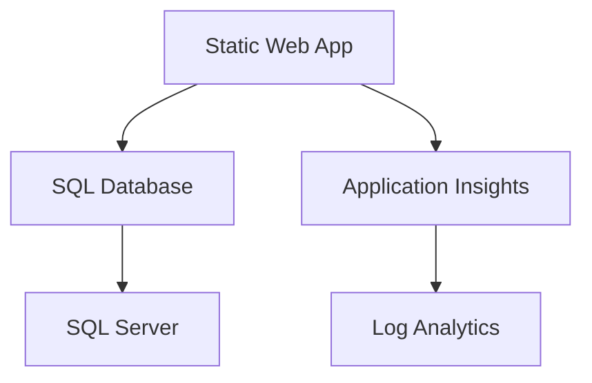

# Resource Inventory: static-webapp

**Generated**: December 17, 2025
**Source**: Infrastructure as Code (Bicep)
**Environment**: Development
**Region**: swedencentral

---

## Summary

| Category            | Count |
| ------------------- | ----- |
| **Total Resources** | 6     |
| 💻 Compute          | 2     |
| 💾 Data Services    | 2     |
| 📊 Monitoring       | 2     |

---

## Resource Listing

### 💻 Compute Resources

| Name                         | Type           | SKU  | Location      | Purpose                |
| ---------------------------- | -------------- | ---- | ------------- | ---------------------- |
| stapp-static-webapp-dev | Static Web App | Free | swedencentral | React/HTML frontend    |
| (integrated)                 | Azure Function | Free | swedencentral | Backend API (with SWA) |

### 💾 Data Services

| Name                         | Type         | SKU         | Configuration      | Location      |
| ---------------------------- | ------------ | ----------- | ------------------ | ------------- |
| sql-staticweba-dev-{suffix}  | SQL Server   | -           | Azure AD-only auth | swedencentral |
| sqldb-static-webapp-dev | SQL Database | S0 (10 DTU) | Basic tier         | swedencentral |

### 📊 Monitoring Resources

| Name                        | Type                 | Configuration              | Location      |
| --------------------------- | -------------------- | -------------------------- | ------------- |
| log-static-webapp-dev  | Log Analytics        | 30-day retention           | swedencentral |
| appi-static-webapp-dev | Application Insights | Connected to Log Analytics | swedencentral |

---

## Resource Configuration Details

### Azure Static Web Apps

| Setting                 | Value                        |
| ----------------------- | ---------------------------- |
| **Name**                | stapp-static-webapp-dev |
| **SKU**                 | Free                         |
| **Build Configuration** | GitHub Actions (auto)        |
| **API Runtime**         | Node.js 18 (Azure Functions) |
| **Custom Domain**       | Not configured               |
| **Authentication**      | Azure AD (configured)        |

### Azure SQL Database

| Setting              | Value                        |
| -------------------- | ---------------------------- |
| **Server Name**      | sql-staticweba-dev-{suffix}  |
| **Database Name**    | sqldb-static-webapp-dev |
| **SKU**              | S0 (10 DTU)                  |
| **Max Size**         | 250 GB                       |
| **Backup Retention** | 7 days (Basic)               |
| **Authentication**   | Azure AD-only                |
| **Firewall**         | Allow Azure services         |
| **TLS Version**      | 1.2 minimum                  |

### Log Analytics Workspace

| Setting       | Value                       |
| ------------- | --------------------------- |
| **Name**      | log-static-webapp-dev  |
| **SKU**       | PerGB2018                   |
| **Retention** | 30 days                     |
| **Daily Cap** | None (using free tier <5GB) |

### Application Insights

| Setting       | Value                       |
| ------------- | --------------------------- |
| **Name**      | appi-static-webapp-dev |
| **Workspace** | log-static-webapp-dev  |
| **Sampling**  | Adaptive (default)          |
| **Daily Cap** | 5 GB (free tier)            |

---

## Tags Applied

| Resource                     | Environment | Project            | Owner | ManagedBy |
| ---------------------------- | ----------- | ------------------ | ----- | --------- |
| stapp-static-webapp-dev | dev         | static-webapp | Team  | Bicep     |
| sql-staticweba-dev-{suffix}  | dev         | static-webapp | Team  | Bicep     |
| sqldb-static-webapp-dev | dev         | static-webapp | Team  | Bicep     |
| log-static-webapp-dev   | dev         | static-webapp | Team  | Bicep     |
| appi-static-webapp-dev  | dev         | static-webapp | Team  | Bicep     |

---

## Resource Dependencies

---

## Cost Summary by Resource

| Resource             | Monthly Cost |
| -------------------- | ------------ |
| Static Web App       | $0.00        |
| Azure Functions      | $0.00        |
| SQL Database (S0)    | $14.52       |
| Application Insights | $0.00        |
| Log Analytics        | $0.00        |
| **Total**            | **$14.52**   |
