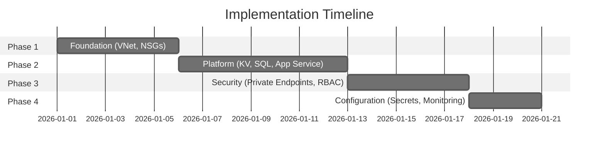

# Step 1: Plan Agent (Project Planner)

> **Agent Used:** `Project Planner` (custom agent in this repository)
> **Purpose:** Create initial deployment plan with requirements and cost estimates

---

## 💬 Prompt

```text
Design a HIPAA-compliant patient portal for Contoso Healthcare.

Business Requirements:
- 10,000 active patients need secure access to medical records
- 50 clinical and administrative staff users
- Appointment scheduling and messaging features
- Must meet HIPAA compliance (BAA required)
- 99.9% uptime SLA minimum

Technical Requirements:
- Web frontend for patients (mobile-responsive)
- REST API backend (.NET 8)
- Patient data database with encryption
- Secure document storage
- Audit logging for compliance

Constraints:
- Budget: $800/month maximum
- Region: swedencentral (default) or germanywestcentral
- 3-month implementation timeline
- Team has Azure experience but limited IaC expertise
- Prefer managed services over IaaS
```

---

## ✅ Output

# Contoso Healthcare Patient Portal - Deployment Plan

Deploy a HIPAA-compliant patient portal using Azure PaaS services in `swedencentral`. The architecture uses
App Service for the .NET 8 API, Azure SQL with encryption at rest, Key Vault for secrets management, and
comprehensive audit logging—all secured via private endpoints and managed identities.

---

## Business Requirements Summary

| Requirement  | Target                     |
| ------------ | -------------------------- |
| Users        | 10,000 patients + 50 staff |
| Availability | 99.9% SLA                  |
| Compliance   | HIPAA (BAA required)       |
| Budget       | $800/month max             |

---

## Recommended Azure Services

| Component          | Service                      | SKU           | Rationale                           |
| ------------------ | ---------------------------- | ------------- | ----------------------------------- |
| Patient Portal API | Azure App Service            | P1v3          | HIPAA BAA covered, VNet integration |
| Patient Database   | Azure SQL Database           | S1 (20 DTU)   | Encryption at rest, Azure AD auth   |
| Secrets Management | Azure Key Vault              | Standard      | HSM-backed secrets, HIPAA compliant |
| Audit Logging      | Log Analytics + App Insights | Pay-as-you-go | 90-day retention for compliance     |
| Document Storage   | Azure Blob Storage           | LRS           | Encryption, private endpoint        |

---

## Network Architecture

| Tier              | Subnet                         | Resources                          | Security           |
| ----------------- | ------------------------------ | ---------------------------------- | ------------------ |
| Web               | `snet-web-prod` (10.0.1.0/24)  | App Service (VNet integrated)      | NSG: HTTPS only    |
| Data              | `snet-data-prod` (10.0.2.0/24) | SQL, Key Vault (private endpoints) | NSG: From web only |
| Private Endpoints | `snet-pe-prod` (10.0.3.0/24)   | Private endpoints                  | No public access   |

---

## Security Considerations (HIPAA)

1. **Access Controls** — Azure AD authentication, RBAC for least privilege
2. **Encryption at Rest** — Azure SQL TDE, Storage service encryption
3. **Encryption in Transit** — TLS 1.2+ enforced on all endpoints
4. **Audit Logging** — All access logged to Log Analytics (90 days)
5. **Private Endpoints** — No public access to data tier
6. **Managed Identities** — No credentials in code/config
7. **Key Vault** — All secrets centrally managed

---

## Estimated Monthly Costs

| Service                | Estimated Cost (USD) |
| ---------------------- | -------------------- |
| App Service (P1v3)     | ~$146                |
| Azure SQL (S1, 20 DTU) | ~$30                 |
| Key Vault              | ~$3                  |
| Storage (100 GB)       | ~$5                  |
| Log Analytics (5 GB)   | ~$15                 |
| Application Insights   | Included             |
| Private Endpoints (×2) | ~$15                 |
| **Total Estimate**     | **~$214/month**      |

> ✅ **Well under $800 budget** — Room for staging environment or additional features

---

## Implementation Phases



### Phase 1 — Foundation (Week 1)

- VNet `vnet-contoso-portal-prod` with 10.0.0.0/16 address space
- 3 subnets: web, data, private endpoints
- NSGs with segmentation rules
- Resource group `rg-contoso-patient-portal-prod`

### Phase 2 — Platform Services (Week 2)

- Key Vault with soft-delete
- App Service Plan (P1v3)
- Azure SQL Server + Database
- Log Analytics Workspace
- Application Insights

### Phase 3 — Security (Week 3)

- Private endpoints for SQL and Key Vault
- App Service VNet integration
- Managed identity configuration

### Phase 4 — Configuration (Week 4)

- Key Vault secrets population
- RBAC role assignments
- Application configuration
- Validation and testing

---

## Open Questions for Next Step

1. **Document Storage** — Azure Blob or Azure Files for medical documents?
2. **Authentication** — Azure AD B2C for patients or Azure AD only?
3. **Disaster Recovery** — Add geo-replication to germanywestcentral?

---

## ➡️ Next Step

Proceed to **`azure-principal-architect`** agent for Well-Architected Framework assessment.
