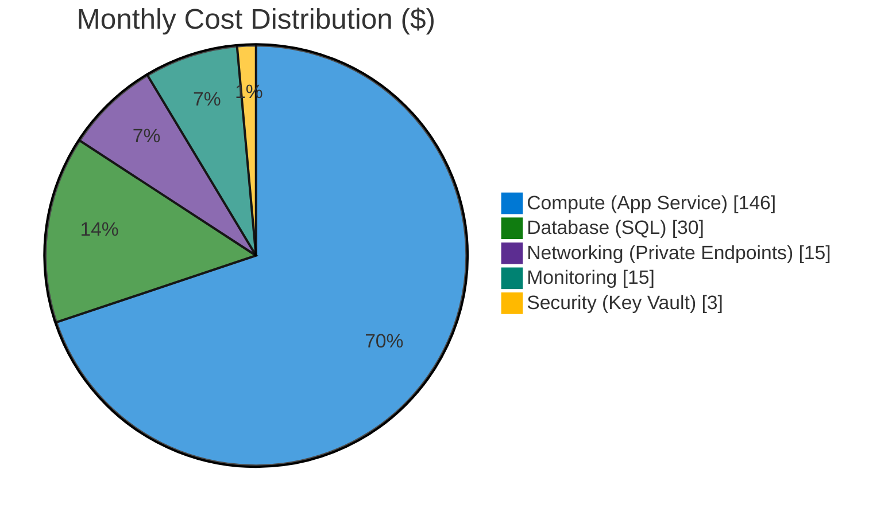

# Contoso Patient Portal - Cost Estimate

**Generated**: 2025-12-04
**Region**: swedencentral (SE Central)
**Environment**: Production
**Compliance**: HIPAA
**Architecture Reference**: [WAF Assessment](./01-azure-architect.md)

---

## Summary

| Metric             | Value             |
| ------------------ | ----------------- |
| Monthly Estimate   | $200 - $250       |
| Annual Estimate    | $2,400 - $3,000   |
| Primary Region     | swedencentral     |
| Pricing Type       | List Price (PAYG) |
| WAF Score          | 8.2/10            |
| Budget             | $800/month        |
| Budget Utilization | 27%               |

### Business Context

This patient portal serves 10,000 patients and 50 staff with HIPAA-compliant access to
medical records, appointment scheduling, and secure messaging. The architecture prioritizes
security and compliance while staying well under the $800/month budget constraint.

---

## Architecture Overview

### Cost Distribution

### Key Design Decisions Affecting Cost

| Decision          | Cost Impact | Business Rationale                  |
| ----------------- | ----------- | ----------------------------------- |
| P1v3 (not P1v4)   | -$60/month  | Zone redundancy not required        |
| SQL S1 (not S2)   | -$31/month  | 20 DTU adequate for workload        |
| Private endpoints | +$15/month  | HIPAA network isolation requirement |
| Single region     | $0          | DR not in initial scope             |

---

## Detailed Cost Breakdown

### Compute Services

| Resource         | SKU        | Qty | $/Hour | $/Month | Notes                   |
| ---------------- | ---------- | --- | ------ | ------- | ----------------------- |
| App Service Plan | P1v3 Linux | 1   | $0.20  | $146.00 | .NET 8, VNet integrated |

**Compute Subtotal**: ~$146/month

### Data Services

| Resource           | SKU         | Config   | $/Day  | $/Month | Notes              |
| ------------------ | ----------- | -------- | ------ | ------- | ------------------ |
| Azure SQL Database | S1 Standard | 20 DTU   | $0.998 | $29.93  | Patient data       |
| Key Vault          | Standard    | ~500 ops | -      | $3.00   | Secrets management |

**Data Subtotal**: ~$33/month

### Networking

| Resource         | SKU | Config      | $/Hour | $/Month | Notes              |
| ---------------- | --- | ----------- | ------ | ------- | ------------------ |
| Private Endpoint | -   | SQL Server  | $0.01  | $7.30   | Database isolation |
| Private Endpoint | -   | Key Vault   | $0.01  | $7.30   | Secrets isolation  |
| VNet             | -   | 10.0.0.0/16 | Free   | $0.00   | Network foundation |
| NSGs (×3)        | -   | 3 subnets   | Free   | $0.00   | Security rules     |

**Networking Subtotal**: ~$15/month

### Monitoring & Management

| Resource             | SKU           | Config      | $/Month | Notes            |
| -------------------- | ------------- | ----------- | ------- | ---------------- |
| Log Analytics        | Pay-as-you-go | ~5 GB/month | $12.42  | 90-day retention |
| Application Insights | Pay-as-you-go | ~5 GB/month | $0.00   | Included with LA |
| Storage (logs)       | LRS           | ~10 GB      | $0.50   | Diagnostic data  |

**Monitoring Subtotal**: ~$13/month

---

## Monthly Cost Summary

| Category   | Monthly Cost | % of Total |
| ---------- | ------------ | ---------- |
| Compute    | $146         | 70%        |
| Data       | $33          | 16%        |
| Networking | $15          | 7%         |
| Monitoring | $13          | 6%         |
| **Total**  | **~$207**    | 100%       |

---

## Budget Analysis

| Metric                 | Value      |
| ---------------------- | ---------- |
| Budget                 | $800/month |
| Estimated Cost         | $207/month |
| Remaining Budget       | $593/month |
| **Budget Utilization** | **26%**    |

### Possible Additions Within Budget

| Addition                    | Monthly Cost | Running Total |
| --------------------------- | ------------ | ------------- |
| Current architecture        | $207         | $207          |
| + Staging environment       | +$150        | $357          |
| + Azure AD B2C (10K MAU)    | +$33         | $390          |
| + SQL Geo-replication       | +$85         | $475          |
| + Azure Front Door Standard | +$40         | $515          |
| + Defender for Cloud        | +$15         | $530          |
| **All additions**           |              | **$530** ✅   |

> ✅ Even with all additions, still $270 under budget

---

## Regional Comparison

| Region             | Monthly Cost | vs. swedencentral | Notes             |
| ------------------ | ------------ | ----------------- | ----------------- |
| eastus             | $165         | -20%              | Lowest cost       |
| westeurope         | $185         | -11%              | EU alternative    |
| swedencentral      | $207         | Baseline          | GDPR compliant ✅ |
| germanywestcentral | $210         | +1%               | German residency  |

> 💡 **Decision**: swedencentral selected for EU data residency despite slightly higher cost.

---

## Savings Opportunities

### Reserved Instances

| Resource         | PAYG/Month | 1-Year RI | Annual Savings |
| ---------------- | ---------- | --------- | -------------- |
| App Service P1v3 | $146.00    | $116.80   | $350 (20%)     |
| SQL S1           | $29.93     | $20.95    | $108 (30%)     |
| **Total**        | **$176**   | **$138**  | **$458/year**  |

### Dev/Test Pricing

| Environment | Config               | Monthly Cost   |
| ----------- | -------------------- | -------------- |
| Production  | P1v3 + S1            | $207           |
| Development | B1 + Basic 5 DTU     | $35            |
| **Savings** | Dev vs. Prod replica | **$172/month** |

---

## Environment Cost Comparison

| Environment | Monthly Cost | Notes                              |
| ----------- | ------------ | ---------------------------------- |
| Production  | $207         | Full P1v3 + S1 + private endpoints |
| Staging     | $150         | Same SKUs, shared monitoring       |
| Development | $35          | Basic SKUs, no private endpoints   |

**Total for all environments**: ~$392/month (still under $800 budget)

---

## Assumptions

- Usage: 730 hours/month (24×7 operation)
- Data transfer: Minimal egress (<10 GB/month)
- Pricing: Azure retail list prices (pay-as-you-go)
- Region: swedencentral (EU GDPR compliant)
- Storage: ~10 GB for logs and diagnostics
- SQL operations: Read-heavy, 20 DTU sufficient

---

## References

- [Azure Pricing Calculator](https://azure.microsoft.com/pricing/calculator/)
- [WAF Assessment](./01-azure-architect.md)
- [Bicep Templates](../../infra/bicep/contoso-patient-portal/)
- [Azure HIPAA BAA](https://learn.microsoft.com/azure/compliance/offerings/offering-hipaa-us)
